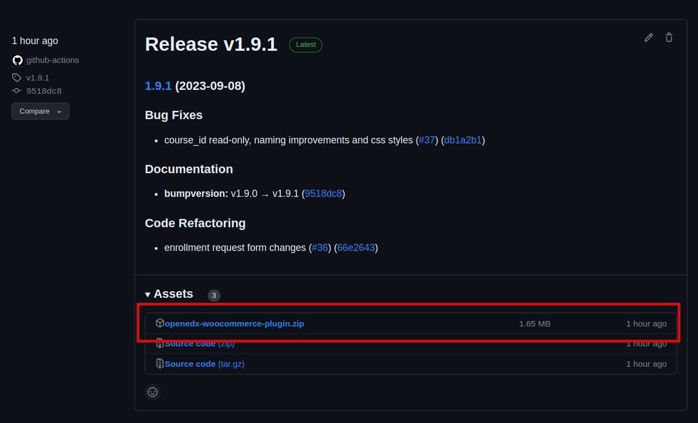

# ⭐ Open edX Commerce (WordPress Plugin)

The "Open edX Commerce" package is a free and open-source WordPress plugin that allows you to integrate WooCommerce with your Open edX platform.

**What does this mean?**
You can create Open edX courses as products in WooCommerce, and when you perform purchase or refund operations for these products, your Open edX platform will reflect these changes.

Here are some things you can do with this plugin:

- **Create Open edX courses as products:** When you create products using WooCommerce, you can designate them as Open edX courses. If you do, you can assign the course mode and course_id you registered in your Open edX platform.

- **Add settings for the connection with Open edX:** You'll have a new option in your WordPress settings to store authentication-related information for your Open edX platform.

- **Enrollment Manager:** You'll have a table that records all enrollment requests made through purchasing products that are Open edX courses.

- **View the enrollment requests from the orders:** When a person purchases WordPress, a WooCommerce order is generated. If an order includes a product that is an Open edX course, you can easily access the related enrollment request created with this plugin.

- **Create enrollments in Open edX:** When an order containing an Open edX course is processed, it automatically creates an enrollment request.
    - You can also include the option to apply the "force" flag, disregarding the course's enrollment end dates.
    - Starting from version Quince of Open edX, you can use the option to create enrollment allowed for non-registered users on the platform.

- **Create soft unenrollments from refunds:** The enrollment record is maintained, but the "is_active" attribute of the enrollment is false. Deleting an "enrollment allowed" is also supported, but only from version Quince.

- **Obtain enrollment information:** This requests the Open edX APIs to retrieve the enrollment status of a user in a course.

# Installation

## Requirements

- PHP 8.0 or greater is recommended
- Wordpress 6.3.1
- [WooCommerce plugin.](https://wordpress.org/plugins/woocommerce)

## Manual installation

- Download the ZIP version on [the release page in the GitHub repository](https://github.com/openedx/openedx-wordpress-ecommerce/releases).

- Log in to your WordPress admin dashboard, navigate to the Plugins menu in the sidebar, click "Add New," upload the ZIP version of this project, and activate the plugin.

<!---
In the search field, type "Open edX WooCommerce Plugin," then click "Search Plugins." Once you've found us, you can view its details and install it by clicking "Install Now," WordPress will take it from there.
-->

# Getting Started

Let's start installing and configuring the Open edx Commerce plugin to connect your WordPress site with the enrollment APIs from your Open edX platform.

[Link to the Quickstart in the documentation.](https://github.com/openedx/openedx-wordpress-ecommerce/blob/main/docs/source/plugin_quickstart.rst)

# Open edX Compatibility

- Tested from Olive

**NOTE:** Enrollment of users who are not platform users (Create course enrollment allowed) is only supported for versions equal to or after Quince.

# Getting Help

To report a bug or request a feature, visit [issues](https://github.com/openedx/openedx-wordpress-ecommerce/issues).

## Documentation

See [documentation on Read the Docs](https://edunext-docs-openedx-woocommerce-plugin.readthedocs-hosted.com/en/latest/index.html).

# How to Contribute

Contributions are very welcome. Please read [How To Contribute](https://openedx.atlassian.net/wiki/spaces/COMM/pages/941457737/How+to+Start+Contributing+Code) for details.

This project accepts all contributions, bug fixes, security fixes, maintenance work, or new features. However, please discuss your new feature idea with the maintainers before beginning development to maximize the chances of accepting your change. You can start a conversation by creating a new issue on this repo summarizing your idea.

# License

The code in this repository is licensed under version 2 of the GNU General Public License. Please see the [LICENSE](LICENSE.txt) file for details.
